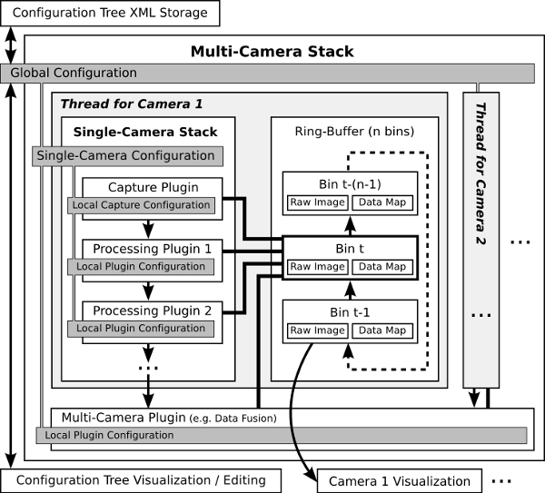
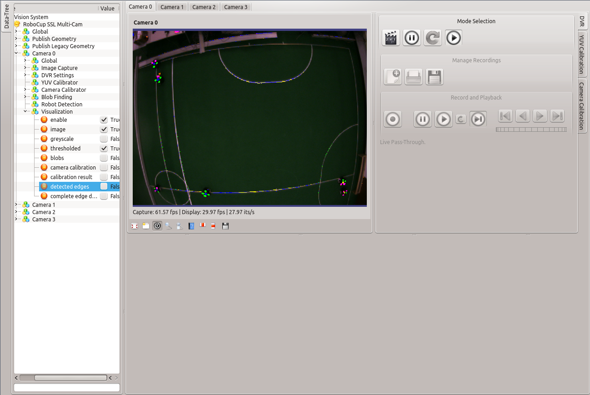

# Application Overview #

## Architecture ##
An visual overview of the software components in the current architecture is below.

## Running Vision Application ##
After successful [camera calibration](CameraCalibration.md) your application should 
look something like this for a single-camera view.

